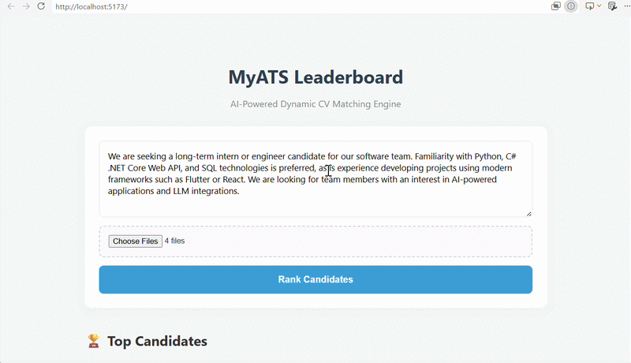

# 🚀 MyATS - AI-Powered Hybrid CV Matching Engine


An advanced, full-stack Applicant Tracking System (ATS) designed to evaluate, score, and rank multiple resumes against dynamic job descriptions. By combining **Deep Learning (Semantic Analysis)** with a **Dynamic Rule-Based Keyword Engine**, MyATS eliminates the "vector dilution" problem often found in standard AI screening tools.

## 🎥 System Demo



---

## The Architecture: How It Works

Traditional ATS systems rely heavily on exact keyword matching, missing out on semantic context. Simple AI models, on the other hand, often give high scores to irrelevant CVs just because they have a similar "tone." 

MyATS solves this with a **Hybrid Scoring System (30% AI + 70% Keyword Matrix)**:

1. **Semantic Vector Search (The AI):** Uses the `paraphrase-multilingual-MiniLM-L12-v2` model to convert the job description and the CV into dense mathematical vectors, calculating their Cosine Similarity.
2. **Dynamic Keyword Extractor (The Logic):** Automatically strips stop-words (and, or, for, etc.) from the job description and extracts the core technical requirements.
3. **Batch Processing:** Processes multiple PDF documents concurrently, evaluates them against the hybrid engine, and returns a sorted leaderboard instantly.

---

## Key Features

* **Multi-CV Batch Processing:** Upload dozens of PDFs simultaneously.
* **Universal Application:** Works for any industry (Software, Marketing, Culinary, etc.) dynamically.
* **Smart Filtering:** Categorizes candidates into `Strong Candidate 🌟`, `Potential Candidate 👍`, and `Weak Match ❌`.
* **Transparent Evaluation:** Displays exact matched skills and accuracy percentages for HR transparency.
* **Modern UI:** Built with React & Vite for a seamless, fast, and responsive user experience.

---

## Tech Stack

### Frontend (User Interface)
* **React 18 & Vite:** For lightning-fast rendering and build times.
* **Axios:** For asynchronous API communication.
* **Custom CSS:** Clean, responsive, and modern card-based UI.

### Backend (AI & API)
* **FastAPI:** High-performance async Python framework.
* **Sentence-Transformers:** Pre-trained NLP models via Hugging Face.
* **PyTorch:** Underlying tensor operations for vector embeddings.
* **PDFPlumber:** High-accuracy text extraction from complex PDF structures.

---

## 🚀 Quick Start (Run Locally)

### 1. Backend Setup
```bash
cd backend

python -m venv venv
venv\Scripts\activate  

pip install -r requirements.txt

uvicorn app.api.main:app --reload
```
The backend will be available at http://127.0.0.1:8000

### 2. Frontend Setup
```bash
cd frontend
npm install
npm run dev
```
The UI will be available at http://localhost:5173
